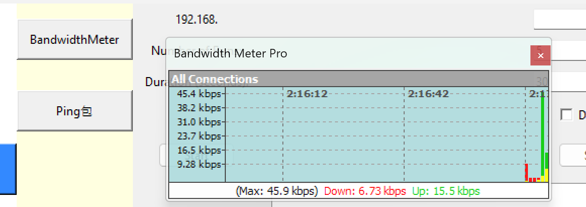

## 激活虚拟环境

```ps1
./Scripts/Activate.ps1
```

## 打包

```sh
pyinstaller ./toolkit.py  -i ./flymodem.ico -y
```

在 `dist/toolkit` 文件夹中找到生成的可执行文件。

将`empty_ping/` `empty_speed/` `multi3.exe` `flymodem.png`拷贝到可执行文件同一目录下。


# live's stability recorder
**record device's status**: Every seconds, ping lib of python to record ping. Using **AT** command to get rsrp, rsrq, pci, band...etc. infors.
**save data into files**: The file's name can be modified. 
It records upload and download while streaming through proxy.

# speed tester
This aims to automatically run **speed testers**, and visaulize the log.
What can be set: time interval, browser, if save result into files, adding or delete speed test websites. 
    
# data analysis:

### ping graphs of lives recorders:

The graph shows how ping changes.


### graph of speed tester


The stats table has the mean, max, min ,stadnard deviation of a set of data. Each data has a graph(upload, download, lag, jit). It also supports uploading multi-files for comparing. 


## ping data of streaming


# iperf3 Automatic tool


# Network tool

forget all wifi by selecting "一键遗忘". Prevent the computer auto connect with other wifi while the speed recorder is running. 

Disable ethernet and enable ehternet are same as doing in control panel. Just for convenience. 

# Other tool



